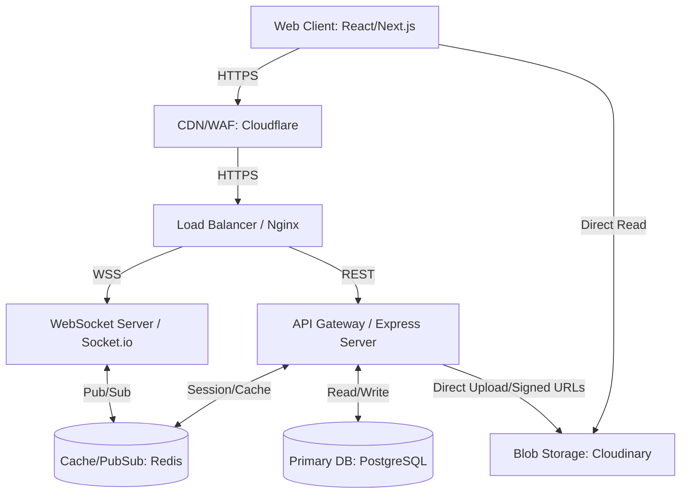
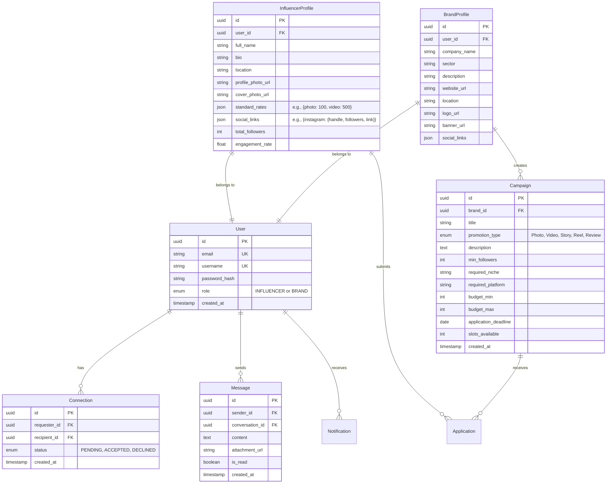

# INFLUX - System Design & Implementation Plan

> [!NOTE]
> This is a complete system design and implementation document for INFLUX, designed for execution by an AI coding assistant. It covers architecture, database schema, API design, and precise frontend specifications for the Influencer-Brand connection platform.

## 1. High-Level Architecture Diagram

## 2. Tech Stack Selection

| Component | Technology | Justification |
| :--- | :--- | :--- |
| **Frontend Framework** | **Next.js (React)** | Provides Server-Side Rendering (SSR) for robust SEO on public profiles, crucial for influencer visibility. Offers intuitive API routes if a BFF (Backend-for-Frontend) is needed. |
| **Styling & Animation** | **Tailwind CSS + Framer Motion** | Tailwind enables rapid, uniform styling and easy dark/light mode toggles. Framer Motion is perfect for the requested glassmorphism elements, parallax effects, and micro-animations. |
| **State Management** | **Zustand + React Query** | Zustand for simple, scalable client state. React Query for robust caching, pagination, and skeleton loading of server data. |
| **Backend Framework** | **Node.js + Express** | Event-driven, non-blocking I/O efficiently handles high-concurrency connections essential for chat and notifications. |
| **Database** | **PostgreSQL (managed)** | Relational model is ideal for structured social graphs (mutual connections, user roles, structured campaign data). |
| **Caching/PubSub** | **Redis** | Powers horizontally scaled Socket.io (using Redis Adapter) and caches compute-heavy queries like search metrics and feed generation. |
| **Real-time** | **Socket.io** | Reliable WebSockets with built-in fallbacks to HTTP long-polling, perfect for chat and notifications. |
| **Storage** | **Cloudinary** | Optimized for serving, cropping, and transforming images (profile photos, banners, logos) via CDN. |

---

## 3. Database Schema

*Using PostgreSQL with Prisma ORM or TypeORM.*

*Indexes required: `username`, `email` on User. `brand_id` on Campaign. `requester_id`, `recipient_id` on Connection. Search indexes manually applied on `InfluencerProfile` based on niches/followers.*

---

## 4. API Design (REST)

| Method | Endpoint | Description | Auth |
| :--- | :--- | :--- | :--- |
| **POST** | `/api/auth/register/influencer` | Create influencer user & profile | None |
| **POST** | `/api/auth/register/brand` | Create brand user & profile | None |
| **POST** | `/api/auth/login` | Authenticate and return JWT & Refresh | None |
| **POST** | `/api/auth/refresh` | Refresh access token | None |
| **GET** | `/api/users/@:username` | Fetch public profile (brand or influencer) | Optional |
| **PATCH** | `/api/profiles/influencer/me` | Update influencer details and rates | Influencer |
| **PATCH** | `/api/profiles/brand/me` | Update brand details and socials | Brand |
| **GET** | `/api/search` | Search users & campaigns (supports filters) | Any |
| **POST** | `/api/connections` | Send connection request | Any |
| **PUT** | `/api/connections/:id` | Accept/Decline connection request | Any |
| **GET** | `/api/campaigns` | List active campaigns (Promote section) | Influencer |
| **POST** | `/api/campaigns` | Create new campaign | Brand |
| **POST** | `/api/campaigns/:id/apply` | Apply to campaign with proposed rate | Influencer |
| **GET** | `/api/conversations` | List user's conversations | Any |
| **GET** | `/api/conversations/:id/messages`| Get paginated chat history | Any |

---

## 5. Real-Time Messaging Architecture

> [!TIP]
> Real-time infrastructure must scale across multiple Node.js instances using a Redis adapter.

**Flow:**
1. User authenticates on Next.js, receives JWT.
2. User establishes Socket.io connection, passing JWT in the handshake auth payload.
3. Server verifies JWT. On success, `socket.join(user_id)` is called to create a private room for the user.
4. When `User A` messages `User B`:
   - `User A` emits `send_message` event with payload `{ recipient_id, content }`.
   - Server saves message to `Message` table in PostgreSQL.
   - Server emits `new_message` to the socket room `User B`'s ID.
   - If `User B` is online, their UI updates instantly.
   - Server emits `message_delivered` back to `User A`.
5. **Typing Indicators:** `socket.emit('typing', { conversation_id })` broadcasted to the conversation members.
6. **Read Receipts:** Emitted when `User B` focuses the chat window.

---

## 6. Authentication & Authorization Flow

**JWT + Refresh Token Strategy:**
- **Access Token:** Short-lived (15 minutes). Sent in the `Authorization: Bearer <token>` header for all protected API requests.
- **Refresh Token:** Long-lived (7 days). Stored in an `HttpOnly`, `Secure`, `SameSite=Strict` cookie to protect against XSS and CSRF.
- When Access Token expires, Frontend intercepts `401 Unauthorized` in Axios/Fetch, calls `/api/auth/refresh` using the cookie, updates the Access Token in memory, and retries the failed request seamlessly.

---

## 7. File Upload System

> [!WARNING]
> Do not proxy file uploads through the Node.js API to reduce server memory overhead.

1. **Client-side Request:** Frontend requests authenticated a signed URL from backend (`/api/upload/signature`).
2. **Backend signs:** Returns signature and timestamp generated with Cloudinary Secret.
3. **Direct Upload:** Client uploads image directly to Cloudinary API using the signature.
4. **Callback:** Client receives the secure Cloudinary URL, and immediately submits a PATCH request to update the user's profile with the new URL.

---

## 8. Notification System Design

- **Architecture:** Push-based for real-time (Socket.io) + Pull-based on reconnect.
- **Events:** Connection request received, connection accepted, new message, application received (for Brands), campaign matched (for Influencers).
- **Storage:** Unread notifications mapped in an `in-memory Cache (Redis)` or lightweight PostgreSQL table. Flushed when viewed.
- **UI:** Ping dot on the Bell icon in the navbar. Toast notifications (using tools like `react-hot-toast`) appear for transient real-time events.

---

## 9. Search & Filter System Design

- **Backend Querying:** Leveraging PostgreSQL Full-Text Search for names and bios.
- **Filtering Logic:** 
  - *Follower Range:* `WHERE total_followers BETWEEN ? AND ?`
  - *Niche:* `WHERE sector = ANY(?)` OR `JSONB` array filtering.
  - *Pagination:* Cursor-based pagination (using the UUID or timestamp) to ensure fast loading on deep scrolls compared to standard `OFFSET/LIMIT`.
- **Debouncing:** Frontend implements a 300ms debounce on the search input to avoid spamming the backend API.

---

## 10. Scalability & Performance Considerations

- **Database:** Setup connection pooling (e.g., PgBouncer) so the serverless or clustered Node instances do not exhaust PSQL connections.
- **Caching:** Cache the Influencer standard rates, total followers (updated via cron jobs rather than strict real-time aggregation), and Brand bios in Redis, as they are read heavy.
- **Image Optimization:** Rely on Cloudinary's `f_auto,q_auto` URL parameters to automatically serve WebP/AVIF formats to modern browsers, radically reducing LCP time.

---

## 11. Security Architecture

- **CORS:** Restrict to the Next.js frontend domain only.
- **Rate Limiting:** `express-rate-limit` to prevent brute force on `/api/auth/*` and spamming connection requests.
- **Input Validation:** Use `Zod` or `Joi` on the backend to validate all JSON payloads matching frontend forms.
- **Sanitization:** Strip dangerous HTML from rich text areas (Campaign descriptions, bios) using `DOMPurify` or server-side equivalents to prevent Stored XSS.

---

## 12. Deployment Architecture

- **Frontend (Next.js):** Vercel. Native support for SSR, fast edge caching, and preview environments for CI/CD.
- **Backend (Node.js/Express & Socket):** AWS ECS, Render, or Railway. Must support WebSocket forwarding.
- **Database:** Managed PostgreSQL (Supabase, AWS RDS, or Render Managed DB) with automated daily backups.
- **CI/CD:** GitHub Actions.
  - *On Pull Request:* Run unit tests, ESLint, and Prettier.
  - *On Merge to Main:* Build Next.js app, build Docker container for Backend, and automatically push/deploy.

---

## 13. Frontend UI/UX Specifics

> [!IMPORTANT]
> The design must immediately convey a premium, exclusive, modern feel. Generic themes are unacceptable. Use deep purples (`#4b1b82`), electric blues (`#00f0ff`), and stark dark themes as the base palette.

### ① HOME PAGE
- **Visuals:** Full-screen hero, animated gradient background. Glassmorphism cards.
- **Elements:**
  - Headlines: "Where Influence Meets Opportunity".
  - CTA Buttons: [Join as Influencer] [Join as Brand] (Hover states: glow and slight lift).
  - Floating mock stats with Framer Motion (e.g., fading in/out softly).
  - Stats Bar (10K+ Influencers, $2M+ Deals).
  - Testimonial carousel and sticky semi-transparent navbar.

### ② AUTHENTICATION
- **Sign In:** Simple card containing Email/Username, Password, Forgot Password link.
- **Sign Up Step 1:** Two massive visual cards [I am an Influencer] / [I am a Brand] with hover scaling.
- **Sign Up Influencer:** Includes standard fields, live `@handle` check, social platform selector, and avatar upload.
- **Sign Up Brand:** Includes company name, sector dropdown, logo upload.

### ③ INFLUENCER PROFILE
- **Structure:** Cover photo, avatar extending below the cover.
- **Social Cards:** Colored mini-cards matching brand colors (e.g., Pink/Orange for Insta, Red for YT) showing followers/handle and acting as live external links.
- **Stats:** Bold typography for Engagement Rate, Avg Likes, etc.
- **Rates Table:** Clean list mapping promotion type to price (Photo Post, Video/Reel, Story, etc.).
- **Actions:** [Connect] and [Message] buttons dynamically disabled if viewing own profile.

### ④ DASHBOARD
- **Overview:** Welcome banner with a progress bar (setup completion).
- **Panels:** Connection Requests (Accept/Decline buttons), Recent Activity Feed.
- **Sidebar Stats:** Quick data points.
- **Recommendations:** Algorithmic grid of suggested users based on niche intersection.

### ⑤ MESSAGES
- **Layout:** Standard two-pane view (List on left, active chat on right).
- **Features:** 
  - Unread badge on chat list.
  - Differentiated sent (right, primary color) and received (left, neutral color) bubbles.
  - `✓✓` read receipts.
  - Live "Typing..." indicators mapped to socket streams.

### ⑥ SEARCH & CONNECT
- **Filters Workspace:** Sidebar containing Platform checkboxes, Follower sliders, category selectors.
- **Grid View:** High-density cards.
  - Avatar, Role badge, Follower count.
- **Interactivity:** A robust connection state machine per card (Connect -> Pending -> Connected/Message).

### ⑦ PROMOTE SECTION (Brand Job Board)
- **Filters:** Niche, Platform, Budget, Deadline.
- **Job Cards:** 
  - Logo, Title, Requirements (e.g., > 50K followers).
  - [Apply Now] opens a glassmorphism modal with a cover-letter text area and a custom bid amount.

### ⑧ BRAND PROFILE
- **Structure:** Banner, Logo, Sector, Website.
- **Tabs:** `About` and `Post Openings` (Internal view only).
- **Post Openings Dashboard:** 
  - [+ Post New Opening] CTA opening a complex modal for Campaign Title, Specs, Budget, and Deadline.
  - Manage existing campaigns (Edit/Delete/View Applicants).

---

## 14. Execution Phasing Plan

1. **Phase 1: Foundation:** Project init, Tailwind setup, global css/palette setup. Database and ORM initialization.
2. **Phase 2: Auth & Core Users:** Next.js pages for Auth and Backend JWT logic. Schema creation for Users/Profiles.
3. **Phase 3: Profiles & UI:** Influencer and Brand profile pages, following the strict aesthetic guidelines. Image uploads via Cloudinary.
4. **Phase 4: Connections & Campaigns:** Building the relational logic for sending requests, and the CRUD for the Promote Section (Brand posts, Influencer applies).
5. **Phase 5: Real-Time:** Implementing the Socket.io server and the full Messages UI.
6. **Phase 6: Polish:** Integrating Framer Motion widely across page transitions, modals, and hover states. Final QA on all responsive states.
